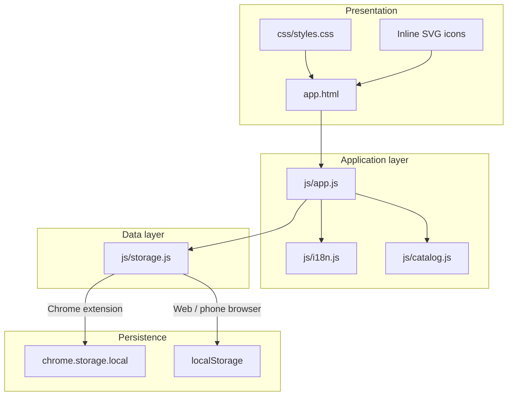

# Restaurant Finance Management System

**ትግስት ሬስቶራንት (Tegest Restaurant)** — browser extension and web-capable app for daily **revenue**, **expenses**, and **profit**, with **Amharic** and **Afaan Oromoo** UI, **light/dark** theme, **cash** and **simulated E-Birr** sales, and **menu** pricing.

---

## System structure

### High-level architecture



### Responsibility overview

| Layer | Role |
|--------|------|
| **Presentation** | `app.html` defines views (setup, login, main: dashboard, sales, expenses, history). `styles.css` handles layout, themes, and components. Icons live in an SVG sprite inside `app.html`. |
| **Application** | `app.js` wires auth, tabs, cart, sales, E-Birr modal, expenses, history, and dashboard totals. |
| **Catalog** | `catalog.js` holds menu groups and default prices; labels in Amharic / Oromiffa. |
| **i18n** | `i18n.js` centralizes UI strings for `am` and `om`. |
| **Storage** | `storage.js` abstracts persistence: uses **`chrome.storage.local`** in the extension, **`localStorage`** when opened as a normal page (e.g. on a phone over HTTP/HTTPS). |

### Directory layout

```text
Restaurant-Finance-Management-system/
├── manifest.json          # Chrome extension (MV3): popup, storage, CSP
├── app.html               # Main UI + SVG icon sprite
├── README.md
├── LICENSE
├── .gitignore
├── css/
│   └── styles.css         # Global styles, light/dark, components
├── js/
│   ├── app.js             # App controller & UI logic
│   ├── storage.js         # Load/save + password hashing (PBKDF2)
│   ├── i18n.js            # Amharic / Oromiffa strings
│   └── catalog.js         # Menu items & default prices
└── tigist-extension (1)/  # Alternate / scaffold bundle (Vite-style build)
    ├── manifest.json
    ├── index.html
    ├── assets/
    └── ...
```

The **primary** app you load as an unpacked extension is the **root** `manifest.json` + `app.html` + `css/` + `js/`. The `tigist-extension (1)/` folder is a separate packaged tree (optional reference).

---

## Features

- First-run **admin account** (name + password), then **login**
- **Dashboard**: today’s revenue, expenses, profit
- **Sales**: menu with editable line prices, cart, **cash** checkout, **E-Birr** flow (simulated payer name until a real API is integrated)
- **Expenses**: description + amount
- **History**: recent transactions + **clear all** history (transactions only)
- **Languages**: Amharic (`am`), Afaan Oromoo (`om`)
- **Themes**: light / dark on login and main views

---

## Run as Chrome / Edge extension

1. Open `chrome://extensions` (or `edge://extensions`).
2. Enable **Developer mode**.
3. **Load unpacked** and select this repository folder (the one containing root `manifest.json`).
4. Pin the extension and open the popup.

---

## Run on phone or any browser (web mode)

The app must be served over **`http://` or `https://`** (not `file://`). Storage automatically uses **`localStorage`** when `chrome.storage` is unavailable.

**Same Wi‑Fi (example):**

```bash
npx --yes serve . -l 3333
```

On your phone, open `http://<your-pc-lan-ip>:3333/app.html`.

**Note:** Data in the extension and data in the mobile browser are **not** synced.

---

## Tech stack

- **Manifest V3** extension
- **Vanilla** HTML / CSS / ES modules (no build step for the main app)
- **Noto Sans Ethiopic** (Google Fonts, allowed in extension CSP)

---

## Repository

- Remote: `https://github.com/babi-Nebula/Restaurant-Finance-Management-system.git`

---

## License

See [LICENSE](LICENSE) in this repository.
